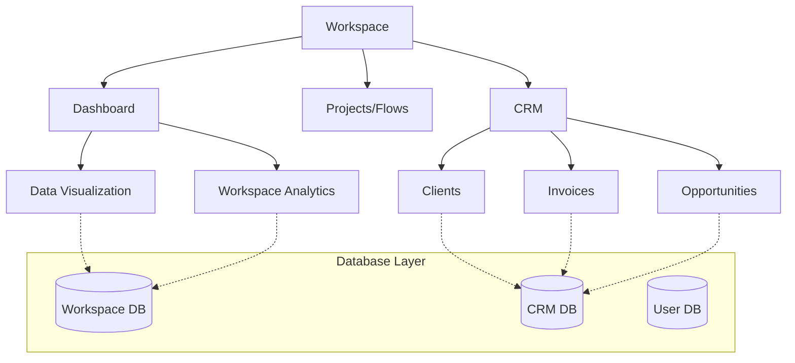
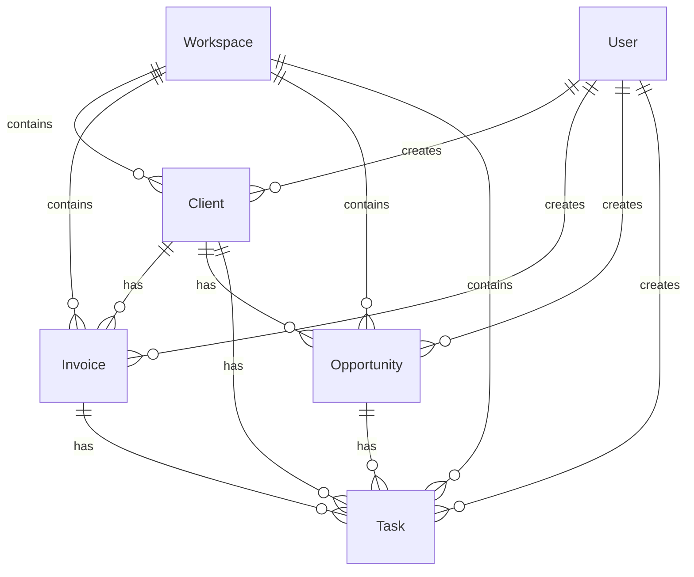
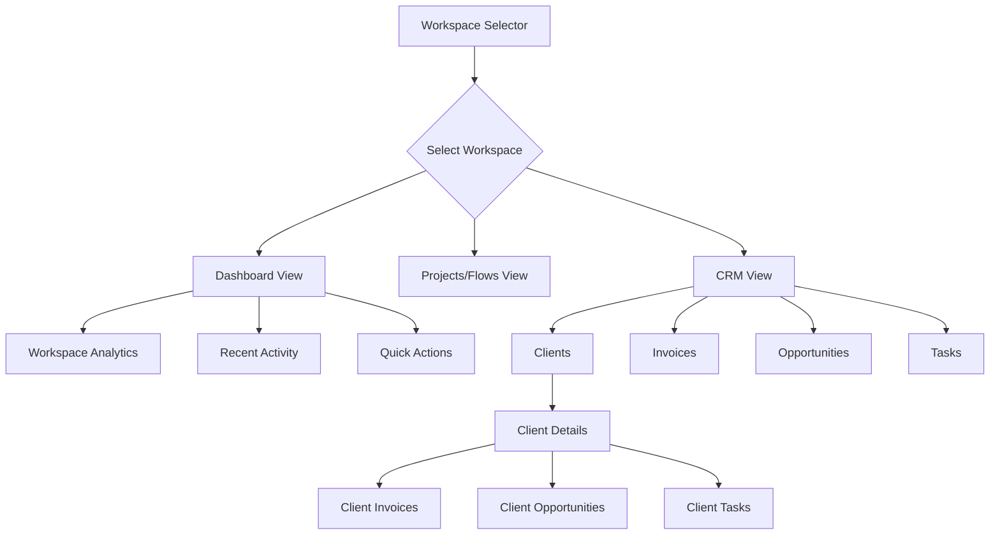

# Workspace Dashboard & CRM Feature Implementation Plan

## Overview

This plan outlines the implementation of a comprehensive CRM system integrated with the existing workspace functionality in Langflow. The implementation will include a dashboard for workspace data visualization, CRM entity management, and context-aware navigation.

## 1. High-Level Architecture Overview



### Key Components

1. **Workspace Dashboard**
   - Data visualization charts for workspace metrics
   - Activity tracking and analytics
   - Quick access to workspace resources

2. **CRM Module**
   - Client management
   - Invoice tracking
   - Opportunity pipeline
   - Task management

3. **Context-Aware Navigation**
   - Sidebar that adapts based on the current view (Dashboard/CRM vs. Flows)
   - Consistent navigation experience

4. **Shared Database Models**
   - CRM entities linked to workspaces and users
   - Permission system for shared CRM data

## 2. Database Schema Design

### New Database Models



### Client Model

```python
class ClientBase(SQLModel):
    """Base model for Client."""
    name: str = Field(index=True)
    email: str | None = Field(default=None)
    phone: str | None = Field(default=None)
    company: str | None = Field(default=None)
    description: str | None = Field(default=None, sa_column=Column(Text))
    status: str = Field(default="active")  # active, inactive, lead

class Client(ClientBase, table=True):
    """Client model for database."""
    id: UUIDstr = Field(default_factory=uuid4, primary_key=True, unique=True)
    workspace_id: UUIDstr = Field(index=True, foreign_key="workspace.id")
    created_by: UUIDstr = Field(index=True, foreign_key="user.id")
    created_at: datetime = Field(default_factory=lambda: datetime.now(timezone.utc))
    updated_at: datetime = Field(default_factory=lambda: datetime.now(timezone.utc))
    
    # Relationships
    workspace: "Workspace" = Relationship(back_populates="clients")
    creator: "User" = Relationship(back_populates="created_clients")
    invoices: list["Invoice"] = Relationship(back_populates="client")
    opportunities: list["Opportunity"] = Relationship(back_populates="client")
    tasks: list["Task"] = Relationship(back_populates="client")
```

### Invoice Model

```python
class InvoiceBase(SQLModel):
    """Base model for Invoice."""
    invoice_number: str = Field(index=True)
    amount: float = Field()
    status: str = Field(default="draft")  # draft, sent, paid, overdue
    issue_date: datetime = Field(default_factory=lambda: datetime.now(timezone.utc))
    due_date: datetime | None = Field(default=None)
    description: str | None = Field(default=None, sa_column=Column(Text))

class Invoice(InvoiceBase, table=True):
    """Invoice model for database."""
    id: UUIDstr = Field(default_factory=uuid4, primary_key=True, unique=True)
    workspace_id: UUIDstr = Field(index=True, foreign_key="workspace.id")
    client_id: UUIDstr = Field(index=True, foreign_key="client.id")
    created_by: UUIDstr = Field(index=True, foreign_key="user.id")
    created_at: datetime = Field(default_factory=lambda: datetime.now(timezone.utc))
    updated_at: datetime = Field(default_factory=lambda: datetime.now(timezone.utc))
    
    # Relationships
    workspace: "Workspace" = Relationship(back_populates="invoices")
    client: "Client" = Relationship(back_populates="invoices")
    creator: "User" = Relationship(back_populates="created_invoices")
    tasks: list["Task"] = Relationship(back_populates="invoice")
```

### Opportunity Model

```python
class OpportunityBase(SQLModel):
    """Base model for Opportunity."""
    name: str = Field(index=True)
    value: float | None = Field(default=None)
    status: str = Field(default="new")  # new, qualified, proposal, negotiation, won, lost
    description: str | None = Field(default=None, sa_column=Column(Text))
    expected_close_date: datetime | None = Field(default=None)

class Opportunity(OpportunityBase, table=True):
    """Opportunity model for database."""
    id: UUIDstr = Field(default_factory=uuid4, primary_key=True, unique=True)
    workspace_id: UUIDstr = Field(index=True, foreign_key="workspace.id")
    client_id: UUIDstr = Field(index=True, foreign_key="client.id")
    created_by: UUIDstr = Field(index=True, foreign_key="user.id")
    created_at: datetime = Field(default_factory=lambda: datetime.now(timezone.utc))
    updated_at: datetime = Field(default_factory=lambda: datetime.now(timezone.utc))
    
    # Relationships
    workspace: "Workspace" = Relationship(back_populates="opportunities")
    client: "Client" = Relationship(back_populates="opportunities")
    creator: "User" = Relationship(back_populates="created_opportunities")
    tasks: list["Task"] = Relationship(back_populates="opportunity")
```

### Task Model

```python
class TaskBase(SQLModel):
    """Base model for Task."""
    title: str = Field(index=True)
    description: str | None = Field(default=None, sa_column=Column(Text))
    status: str = Field(default="open")  # open, in_progress, completed, cancelled
    priority: str = Field(default="medium")  # low, medium, high
    due_date: datetime | None = Field(default=None)

class Task(TaskBase, table=True):
    """Task model for database."""
    id: UUIDstr = Field(default_factory=uuid4, primary_key=True, unique=True)
    workspace_id: UUIDstr = Field(index=True, foreign_key="workspace.id")
    created_by: UUIDstr = Field(index=True, foreign_key="user.id")
    assigned_to: UUIDstr | None = Field(default=None, foreign_key="user.id")
    client_id: UUIDstr | None = Field(default=None, foreign_key="client.id")
    invoice_id: UUIDstr | None = Field(default=None, foreign_key="invoice.id")
    opportunity_id: UUIDstr | None = Field(default=None, foreign_key="opportunity.id")
    created_at: datetime = Field(default_factory=lambda: datetime.now(timezone.utc))
    updated_at: datetime = Field(default_factory=lambda: datetime.now(timezone.utc))
    
    # Relationships
    workspace: "Workspace" = Relationship(back_populates="tasks")
    creator: "User" = Relationship(back_populates="created_tasks", foreign_key="created_by")
    assignee: "User" = Relationship(back_populates="assigned_tasks", foreign_key="assigned_to")
    client: "Client" = Relationship(back_populates="tasks")
    invoice: "Invoice" = Relationship(back_populates="tasks")
    opportunity: "Opportunity" = Relationship(back_populates="tasks")
```

## 3. UI/UX Workflow Diagrams

### Navigation Flow



### Dashboard Layout

```
+-------------------------------------------------------+
|                     Header                            |
+-------------------------------------------------------+
| Sidebar |                                             |
|         |  +-------------------+  +----------------+  |
|         |  |                   |  |                |  |
|         |  |  Workspace Stats  |  |  Recent        |  |
|         |  |                   |  |  Activity      |  |
|         |  +-------------------+  |                |  |
|         |                         +----------------+  |
|         |  +-------------------+  +----------------+  |
|         |  |                   |  |                |  |
|         |  |  Client Overview  |  |  Tasks         |  |
|         |  |                   |  |                |  |
|         |  +-------------------+  +----------------+  |
|         |                                             |
+---------+---------------------------------------------+
```

## 4. Modular Tasks Breakdown

### Backend Tasks

1. **Database Schema Implementation**
   - Create new models for CRM entities
   - Update existing models with new relationships
   - Create database migration scripts

2. **API Endpoint Implementation**
   - Create CRUD endpoints for CRM entities
   - Implement filtering and search functionality
   - Add permission checks for shared resources

3. **Dashboard Data Services**
   - Create services for aggregating workspace metrics
   - Implement activity tracking
   - Build data visualization endpoints

### Frontend Tasks

1. **Dashboard UI Components**
   - Create dashboard layout
   - Implement data visualization charts using D3.js
   - Build activity feed component

2. **CRM UI Components**
   - Create client management interface
   - Build invoice tracking system
   - Implement opportunity pipeline
   - Develop task management interface

3. **Navigation and Routing**
   - Update sidebar to be context-aware
   - Implement new routes for dashboard and CRM views
   - Create breadcrumb navigation

4. **State Management**
   - Extend workspace store with CRM-related state
   - Create new stores for CRM entities
   - Implement caching for dashboard data

## 5. Implementation Priorities and Dependencies

### Phase 1: Foundation
1. Database schema design and implementation
2. Basic API endpoints for CRM entities
3. Dashboard sidebar icon and navigation

### Phase 2: Dashboard Implementation
1. Dashboard layout and basic components
2. Data visualization charts
3. Activity tracking

### Phase 3: CRM Core Features
1. Client management
2. Invoice tracking
3. Task management

### Phase 4: Advanced Features
1. Opportunity pipeline
2. Reporting and analytics
3. Export/import functionality

## 6. Technical Considerations

### Data Visualization
- Use D3.js for custom charts and visualizations
- Leverage existing table components for data display
- Consider using ag-Grid for complex data grids

### State Management
- Extend the existing Zustand store pattern
- Create separate stores for CRM entities
- Implement optimistic updates for better UX

### Performance
- Implement pagination for large datasets
- Use caching for dashboard metrics
- Consider lazy loading for CRM entity details

### Security
- Ensure proper access control for shared CRM data
- Validate permissions at both API and UI levels
- Implement audit logging for sensitive operations

## 7. Next Steps

1. Begin with database schema implementation
2. Create basic API endpoints
3. Implement dashboard sidebar navigation
4. Build initial dashboard layout
5. Develop CRM entity management interfaces
