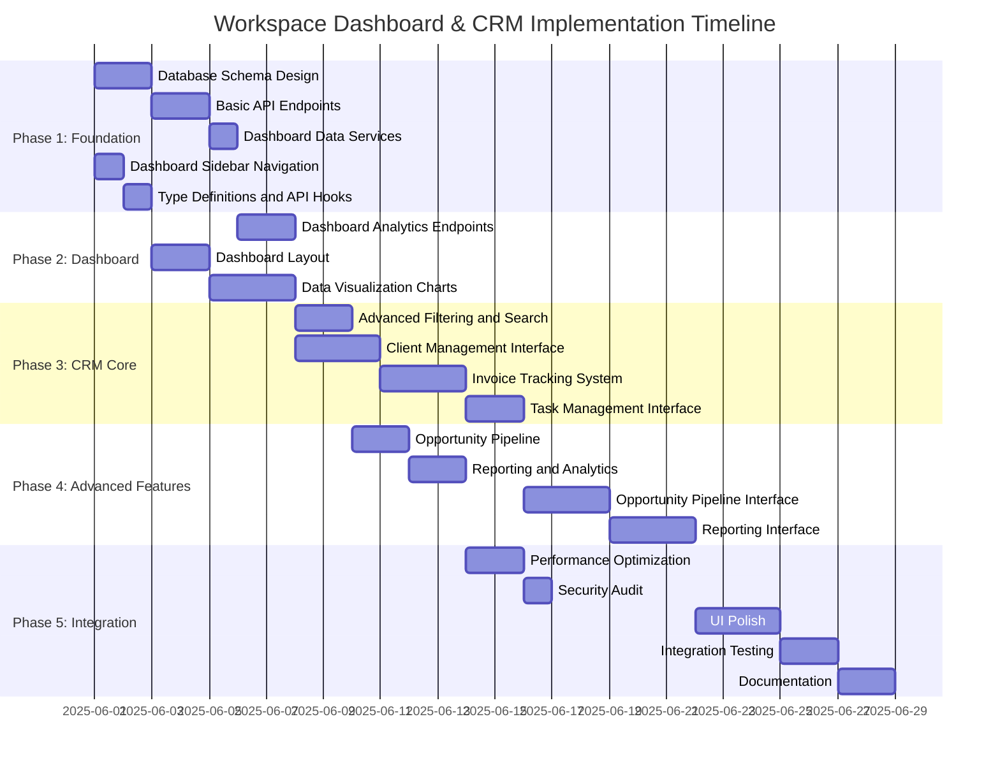

# Workspace Dashboard & CRM Implementation Timeline

## Overview

This document outlines the implementation timeline and task breakdown for the Workspace Dashboard & CRM feature. The implementation is divided into phases, with each phase building upon the previous one to deliver a complete and cohesive feature set.

## Phase 1: Foundation (Week 1)

### Backend Tasks

1. **Database Schema Design and Implementation** (2 days)
   - Create CRM entity models (Client, Invoice, Opportunity, Task)
   - Update existing models with new relationships
   - Write database migration scripts
   - Run and test migrations

2. **Basic API Endpoints** (2 days)
   - Implement CRUD endpoints for CRM entities
   - Add permission checks for shared resources
   - Write unit tests for API endpoints

3. **Dashboard Data Services** (1 day)
   - Create services for aggregating workspace metrics
   - Implement data visualization endpoints
   - Write unit tests for dashboard services

### Frontend Tasks

1. **Dashboard Sidebar Icon and Navigation** (1 day)
   - Add dashboard icon to sidebar
   - Update routing configuration
   - Implement context-aware sidebar navigation

2. **Type Definitions and API Hooks** (1 day)
   - Create TypeScript interfaces for CRM entities
   - Set up RTK Query API hooks for backend communication
   - Configure store integration

### Deliverables
- Complete database schema with migrations
- Functional API endpoints for CRM entities
- Basic navigation structure with dashboard icon
- TypeScript type definitions and API hooks

## Phase 2: Dashboard Implementation (Week 2)

### Backend Tasks

1. **Dashboard Analytics Endpoints** (2 days)
   - Implement workspace statistics endpoints
   - Create client distribution data endpoints
   - Add revenue timeline data endpoints
   - Write unit tests for analytics endpoints

### Frontend Tasks

1. **Dashboard Layout and Basic Components** (2 days)
   - Create dashboard page layout
   - Implement workspace statistics card
   - Add placeholder charts and data displays

2. **Data Visualization Charts** (3 days)
   - Implement client distribution pie chart
   - Create revenue timeline chart
   - Build task priority distribution chart
   - Add responsive design for mobile views

### Deliverables
- Functional dashboard with real data visualization
- Complete set of analytics endpoints
- Responsive design for different screen sizes

## Phase 3: CRM Core Features (Week 3)

### Backend Tasks

1. **Advanced Filtering and Search** (2 days)
   - Implement filtering for CRM entities
   - Add search functionality
   - Create pagination support
   - Write unit tests for filtering and search

### Frontend Tasks

1. **Client Management Interface** (3 days)
   - Create clients list view
   - Implement client details view
   - Build client creation/edit forms
   - Add client deletion with confirmation

2. **Invoice Tracking System** (3 days)
   - Create invoices list view
   - Implement invoice details view
   - Build invoice creation/edit forms
   - Add invoice status management

3. **Task Management Interface** (2 days)
   - Create tasks list view
   - Implement task details view
   - Build task creation/edit forms
   - Add task assignment functionality

### Deliverables
- Complete client management interface
- Functional invoice tracking system
- Task management with assignment capabilities
- Advanced filtering and search functionality

## Phase 4: Advanced Features (Week 4)

### Backend Tasks

1. **Opportunity Pipeline** (2 days)
   - Implement opportunity stages
   - Create opportunity analytics endpoints
   - Add opportunity forecasting calculations
   - Write unit tests for opportunity pipeline

2. **Reporting and Analytics** (2 days)
   - Create advanced reporting endpoints
   - Implement data export functionality
   - Add historical data comparison
   - Write unit tests for reporting features

### Frontend Tasks

1. **Opportunity Pipeline Interface** (3 days)
   - Create opportunities list view
   - Implement opportunity details view
   - Build opportunity creation/edit forms
   - Add pipeline visualization

2. **Reporting and Analytics Interface** (3 days)
   - Create reports dashboard
   - Implement data export functionality
   - Add custom report builder
   - Build report visualization components

### Deliverables
- Complete opportunity pipeline management
- Advanced reporting and analytics
- Data export functionality
- Custom report builder

## Phase 5: Integration and Polish (Week 5)

### Backend Tasks

1. **Performance Optimization** (2 days)
   - Implement caching for dashboard metrics
   - Optimize database queries
   - Add background processing for reports
   - Write performance tests

2. **Security Audit** (1 day)
   - Review permission checks
   - Implement audit logging
   - Test security boundaries
   - Fix any security issues

### Frontend Tasks

1. **UI Polish and Refinement** (3 days)
   - Implement consistent styling
   - Add animations and transitions
   - Improve error handling and feedback
   - Enhance accessibility

2. **Integration Testing** (2 days)
   - Test all features end-to-end
   - Verify mobile responsiveness
   - Check cross-browser compatibility
   - Fix any integration issues

3. **Documentation** (2 days)
   - Create user documentation
   - Write developer documentation
   - Add inline code comments
   - Create demo videos

### Deliverables
- Optimized and secure backend
- Polished and consistent UI
- Comprehensive documentation
- End-to-end tested feature set

## Task Dependencies

## Resource Allocation

### Backend Development
- 1 Senior Backend Developer (Full-time)
- 1 Backend Developer (Full-time)

### Frontend Development
- 1 Senior Frontend Developer (Full-time)
- 1 Frontend Developer (Full-time)

### Design and UX
- 1 UI/UX Designer (Part-time)

### QA and Testing
- 1 QA Engineer (Part-time, full-time during Phase 5)

## Risk Assessment

### Potential Risks

1. **Database Schema Complexity**
   - Risk: Complex relationships between CRM entities might lead to performance issues
   - Mitigation: Careful schema design with performance testing early in Phase 1

2. **Data Visualization Performance**
   - Risk: Large datasets might cause performance issues in charts and visualizations
   - Mitigation: Implement pagination, filtering, and data aggregation at the API level

3. **Mobile Responsiveness**
   - Risk: Complex dashboard layouts might not translate well to mobile devices
   - Mitigation: Mobile-first design approach and regular testing on different screen sizes

4. **Integration with Existing Workspace Features**
   - Risk: New features might conflict with existing workspace functionality
   - Mitigation: Thorough integration testing and clear separation of concerns

5. **Permission Management Complexity**
   - Risk: Complex permission rules might lead to security issues or usability problems
   - Mitigation: Comprehensive security audit and user testing of permission scenarios

## Success Criteria

1. **Functionality**
   - All planned features are implemented and working correctly
   - CRM entities can be created, read, updated, and deleted
   - Dashboard displays accurate and relevant data
   - Permission system correctly restricts access based on user roles

2. **Performance**
   - Dashboard loads within 2 seconds on standard connections
   - CRM entity lists handle at least 1000 records without performance degradation
   - Charts and visualizations render within 1 second

3. **Usability**
   - Users can navigate between dashboard and CRM features intuitively
   - Forms provide clear validation and feedback
   - Mobile experience is functional and user-friendly
   - Accessibility standards are met (WCAG 2.1 AA)

4. **Security**
   - All CRM data is properly isolated between workspaces
   - Permission checks are enforced at both API and UI levels
   - Sensitive operations are properly logged

## Next Steps

1. Finalize and approve the implementation plan
2. Set up project tracking in issue management system
3. Assign resources to Phase 1 tasks
4. Schedule regular progress reviews
5. Begin implementation of Phase 1
